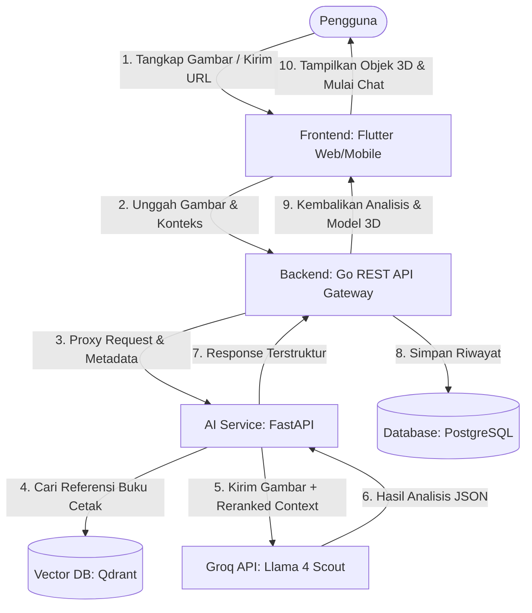
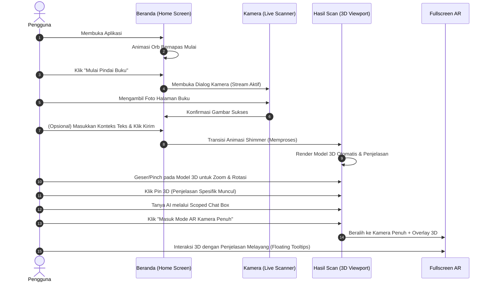

# 📘 Dokumen Analisa Fungsional & Desain Produk — ARise Learn

Dokumen ini berisi penjelasan mendetail mengenai **Analisa Fungsional** dan **Desain Produk** dari platform pembelajaran berbasis Augmented Reality (AR) dan kecerdasan buatan, **ARise Learn**.

---

## 🔬 1. Analisa Fungsional Teknologi Digital

Bagian ini menguraikan bagaimana setiap komponen dan fungsi dari sistem **ARise Learn** bekerja secara teknis untuk memproses input pengguna hingga menyajikan model 3D dan interaksi berbasis AI RAG (Retrieval-Augmented Generation).

### 🛰️ Alur Arsitektur Sistem (High-Level)

Berikut adalah visualisasi interaksi fungsional antar-layanan saat pengguna melakukan pemindaian materi belajar:

---

### 📥 A. Modul Pemindaian Multimodal (Multimodal Scanning Module)
Modul ini bertugas menangkap materi pembelajaran dalam bentuk visual (buku cetak, halaman teks, atau diagram) dan menerjemahkannya ke dalam representasi digital.

1. **Input Capture (Kamera & Presets)**:
   * Pengguna dapat menggunakan kamera perangkat secara *real-time* menggunakan paket `camera_web` untuk menangkap area buku cetak.
   * Alternatifnya, pengguna dapat memasukkan URL gambar secara langsung atau menggunakan *Preset cepat* (DNA Helix, Jantung Manusia, Atom Bohr, Molekul H2O) untuk pengujian instan.
2. **Konteks Multimodal Opsional**:
   * Pengguna dapat menambahkan teks petunjuk tambahan sebelum analisis dimulai (misal: *"jelaskan bagian mitokondria"*).
3. **Proses Pengiriman**:
   * Berkas gambar dikompresi ke bentuk data biner / multipart-form, dikirim ke `/api/v1/scan/upload` pada Go Backend, kemudian diteruskan melalui klien HTTP asinkron ke `/api/v1/analyze` pada AI Service.

---

### 🧠 B. Modul RAG & LLM Analysis (AI Service Pipeline)
Modul ini merupakan otak dari platform, yang menganalisis konten visual dan teks menggunakan pendekatan hybrid: LLM vision dan pencarian dokumen lokal (RAG).

1. **Retrieval-Augmented Generation (RAG)**:
   * Saat gambar diterima, sistem mengekstrak metadata teks (jika ada konteks tambahan).
   * Klien RAG melakukan pencarian vektor pada **Qdrant Vector DB** menggunakan embedding model `sentence-transformers/all-MiniLM-L6-v2` untuk mencari potongan dokumen akademik yang relevan.
   * Jika database Qdrant offline, sistem secara otomatis melakukan *in-memory fallback* agar sistem tidak terhenti.
2. **Multimodal LLM Processing (Groq API)**:
   * Gambar beserta teks referensi akademik yang diperoleh dari Qdrant dikirim ke **Groq API** menggunakan model `meta-llama/llama-4-scout-17b-16e-instruct`.
   * Model menganalisis gambar dan teks secara bersamaan untuk menghasilkan respons format JSON terstruktur yang berisi:
     * `subject_topic`: Topik akademik yang terdeteksi.
     * `explanation`: Deskripsi materi yang mudah dipahami oleh siswa.
     * `asset_3d_hint`: Rekomendasi model 3D yang sesuai (Heart, DNA, Water, Atom, dsb).
     * `confidence`: Tingkat keyakinan model AI terhadap hasil analisis.
3. **Robust Error Handling**:
   * Jika format gambar base64 atau URL bermasalah, AI Service mendeteksi error tersebut secara otomatis dan beralih ke *text-only prompt fallback* untuk menghindari kegagalan sistem total.

---

### 🧬 C. Modul Proyeksi Viewport 3D Dinamis
Modul ini menampilkan visualisasi objek 3D interaktif yang sesuai dengan materi pelajaran yang terdeteksi.

1. **Seleksi Model Dinamis**:
   * Aplikasi Flutter membaca nilai `asset_3d_hint` dari respons AI. Objek viewport akan memuat model 3D yang sesuai secara real-time dari direktori lokal (`assets/models/`).
2. **Pinch-to-Zoom & Scroll Isolation**:
   * Diimplementasikan `ScaleGestureRecognizer` dan deteksi posisi kursor. 
   * Jika kursor berada di dalam batas viewport 3D, *page scrolling* akan diisolasi (dimatikan) dan dialihkan menjadi perintah *zoom in/out* objek 3D menggunakan scroll wheel atau cubitan trackpad/layar sentuh.
3. **Hotspot Pins & Penjelasan Interaktif**:
   * Setiap model memiliki koordinat pin 3D (*hotspots*) yang relevan:
     * **Jantung**: Aorta, Myocardium, Valve.
     * **DNA**: Double Helix Backbone, Base Pair.
     * **Air (H2O)**: Oxygen Atom, Hydrogen Atoms, Covalent Bonds.
     * **Atom**: Nucleus, Electrons, Orbit.
   * Menekan pin tertentu akan memicu perubahan status UI, memunculkan kartu detail penjelasan (*glow border*) yang warnanya disesuaikan dengan warna bagian yang dipilih.

---

### 💬 D. Modul Chat Akademik Terarah (Scoped AI Chat)
Modul ini memfasilitasi tanya jawab interaktif antara siswa dan asisten AI, dengan pembatasan topik (*scoping*) demi menjaga fokus belajar.

1. **Topik Terkunci (Scoped Prompting)**:
   * Sistem menyisipkan perintah sistem (*system prompt*) yang mengunci ruang lingkup pembicaraan hanya pada topik hasil pemindaian.
   * Jika siswa bertanya hal di luar topik (misal: *"bagaimana cara membuat nasi goreng"*), AI akan merespons dengan sopan bahwa ia hanya bisa mendiskusikan materi akademik yang sedang di-scan.
2. **Integrasi RAG Lanjutan**:
   * Setiap pertanyaan chat baru akan dikombinasikan dengan riwayat chat sebelumnya dan ditanyakan kembali ke basis pengetahuan Qdrant untuk mendapatkan konteks terbaru sebelum dijawab oleh LLM.

---

### 🕶️ E. Modul Fullscreen Augmented Reality (AR) Mode
Modul ini memproyeksikan objek 3D ke lingkungan nyata melalui kamera perangkat.

1. **Webcam Overlay & Viewport Alignment**:
   * Kamera aktif dirender di latar belakang penuh (*fullscreen background*), sementara model 3D dirender secara transparan di atas feed video.
2. **Floating 3D Tooltips**:
   * Menggunakan perhitungan posisi koordinat relatif 3D terhadap viewport kamera (`_getSelectedPartOffset()`).
   * Tooltip penjelasan melayang mengikuti pergerakan model 3D di layar, lengkap dengan pointer penunjuk bergaya futuristik cyberpunk.

---

## 🎨 2. Desain Produk Teknologi Digital

Desain produk **ARise Learn** mengutamakan estetika modern, premium, dan intuitif untuk menarik minat generasi pelajar modern. Desain ini menerapkan gaya **Glassmorphic Cyberpunk** yang didominasi warna gelap (*Deep Dark Mode*).

### 🎨 Palet Warna & Tipografi

* **Warna Utama (Primary)**: `#6366F1` (Indigo Neon) — Memberikan kesan teknologi tinggi dan kecerdasan.
* **Warna Sekunder (Secondary)**: `#06B6D4` (Cyan Electric) — Digunakan untuk elemen interaktif, indikator sukses, dan aksen 3D.
* **Warna Latar (Background)**: `#0B0F1A` (Deep Navy) — Latar gelap pekat untuk meningkatkan keterbacaan teks neon dan visualisasi model 3D.
* **Tipografi**: Menggunakan font **Outfit** dan **Inter** dari Google Fonts. Karakter font sans-serif dengan sudut tegas memberikan nuansa modern dan bersih.

---

### 📐 Tata Letak & Elemen Glassmorphism
Aplikasi dirancang agar responsif (dibatasi lebar maksimal 900px pada desktop agar terlihat seperti aplikasi mobile premium yang terpusat).

1. **Card Glassmorphism**:
   * Komponen kartu menggunakan latar belakang semi-transparan dengan ketebalan blur tinggi (`BackdropFilter` dengan `sigmaX/Y: 12.0`) dan opasitas warna putih `0.04` (dark) atau `0.3` (light).
   * Batas kartu (*border*) diberi warna putih dengan opasitas sangat tipis (`0.08`), memberikan efek pembiasan cahaya seperti kaca asli.
2. **Breathing Gradient Orbs**:
   * Lingkaran gradasi animasi berwarna biru dan ungu diletakkan di latar belakang. Lingkaran ini membesar dan mengecil secara perlahan menggunakan `AnimationController` untuk menciptakan nuansa antarmuka yang "hidup" dan dinamis.
3. **Glow Effects**:
   * Elemen penting seperti tombol utama, kartu hasil pemindaian yang sukses, dan pin 3D yang aktif memiliki efek *outer shadow* neon terang yang memperkuat gaya visual cyberpunk.

---

### 🕹️ Diagram Alur Interaksi Pengguna (User Interaction Flow)

Desain interaksi dibangun secara linear untuk meminimalkan *cognitive load* (beban berpikir) pengguna:

---

### 📱 Detail Komponen UI Utama

#### 1. Scanner Hero Card (Beranda)
* **Visual**: Berupa kartu besar bergradasi dinamis yang memikat perhatian langsung saat aplikasi dibuka.
* **Interaksi**: Berisi tombol besar "Buka Kamera Scanner" dan kolom input tautan (*link*) manual dengan animasi tombol kirim berikon panah futuristik. Di bawahnya terdapat preset chip gambar cepat untuk demonstrasi instan.

#### 2. Bottom Navigation Bar Glassmorphic
* **Visual**: Melayang di atas konten utama dengan margin lateral (24px) dan sudut membulat sempurna (radius 30). Efek blur kaca (`BackdropFilter`) membiarkan konten di belakangnya samar terlihat saat di-scroll.
* **Interaksi**: Terdiri dari 4 ikon navigasi (Beranda, Cari, AR, Profil). Ikon aktif akan mendapatkan latar belakang kapsul bergradasi lembut dan ikonnya berubah menjadi warna Indigo terang.

#### 3. Viewport & HUD 3D (Hasil Scan)
* **Visual**: Frame berbentuk persegi dengan batas sudut tumpul, menampilkan model 3D di tengah-tengah latar belakang gelap gulita dengan tambahan *axes gizmo* (indikator koordinat X/Y/Z) di sudut kiri bawah untuk panduan spasial siswa.
* **Interaksi**: 
  * Sentuh & Seret: Rotasi model 3D.
  * Cubit/Scroll: Zoom model 3D.
  * Klik Tombol HUD: Mengatur ulang rotasi kamera viewport ke posisi awal (*reset view*).
  * Klik Pin: Memunculkan *interactive callout card* melayang yang mendeskripsikan anatomi/bagian objek tersebut.

---

> [!NOTE]  
> Kombinasi antara analisis fungsional berbasis **RAG AI** dan desain visual **Glassmorphic Cyberpunk** menciptakan pengalaman belajar yang tidak hanya informatif secara akademis, tetapi juga sangat memukau secara visual bagi para pengguna.
